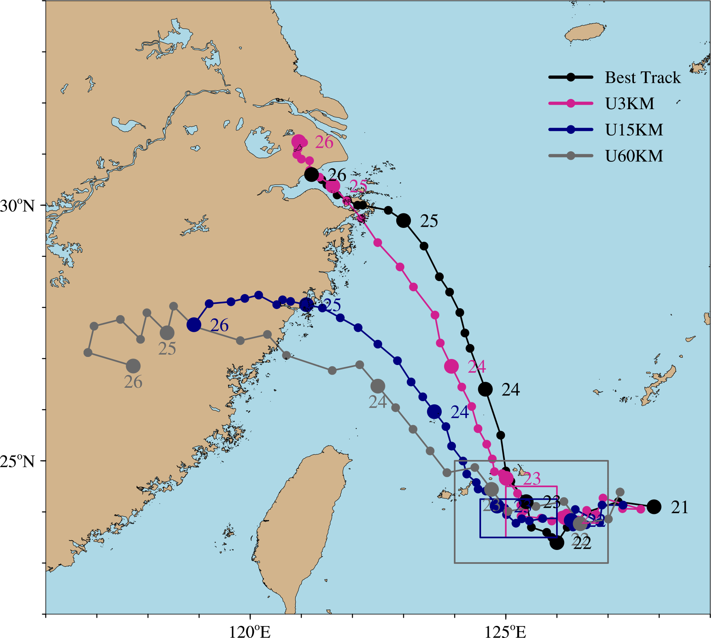

# The code used in iAMAS-Typhoon-paper (including plot and diagnostics)
>[!NOTE]
> The repository in under development, if any question, please issue.

>[!IMPORTANT]
> Every Figure? directory contains codes and output pngs

## Figure 1
Every subplot in Figure 1 was produced using NCL language.

  

## Figure2

## Figure3

## Figure4

## Figure5

